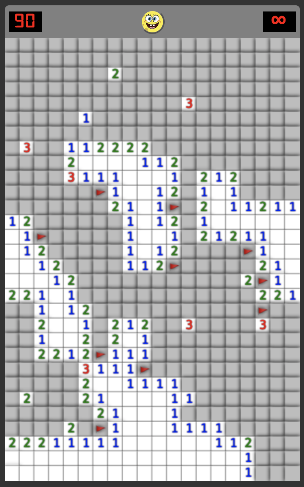
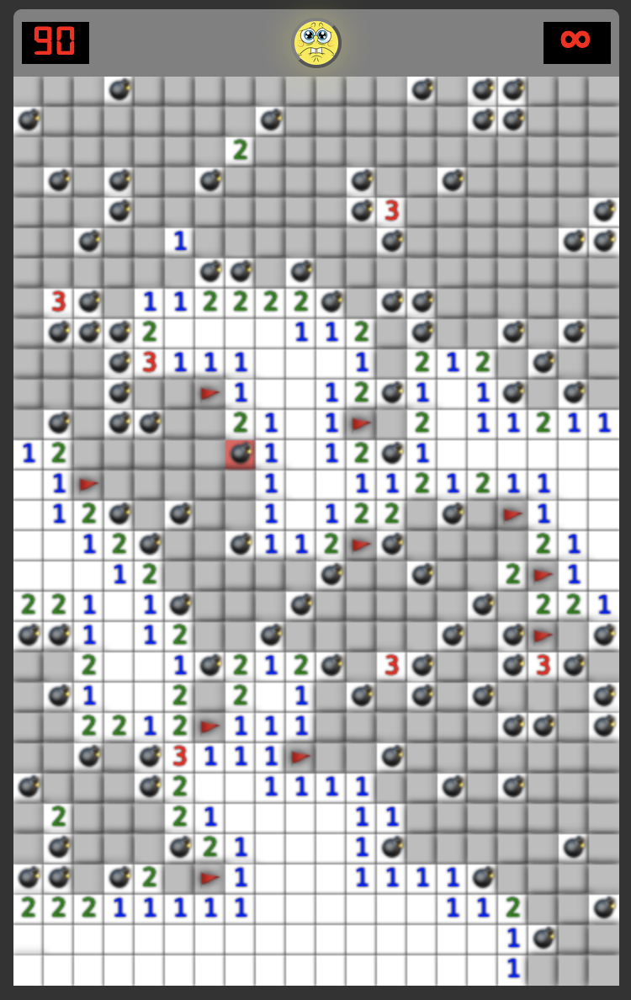

## Minesweeper game 

Revealing all the cells without hitting the mines is the task. Each number in the cell denotes how many bombs are in the adjacent cells (8 sides). You can mark any arbitrary cell with a flag.

This game is developed with Rust, WebAssembly (Wasm), and Canvas. Live demo available [here](https://karthiknedunchezhiyan.me/minesweeper/)

## Screenshots

Screenshot 1             |  Screenshot 2  
:-------------------------:|:-------------------------:
  |  

## Functionality

- ✅ First click will always an empty cell.
- ✅ Right click on PC and long press on touch devices to place the flag.
- ✅ Clicking on SpongeBob will reset the game.
- ⬜️ Option to select difficulty level.
- ⬜️ Customize board size and mines count.